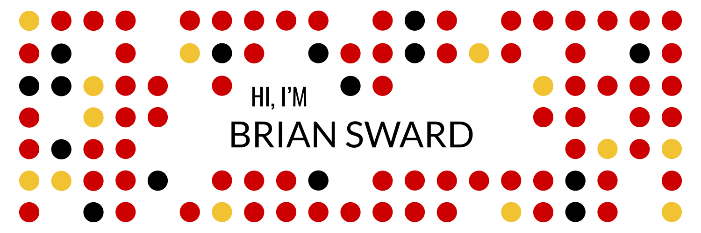

- 🔭 I’m currently working on my advanced certification in Python Development
- 🌱 I’m currently learning at Code Fellows in Seattle, WA
- 👯 I’m looking to collaborate on open source projects where I can contribute with my ample math yet and burgoning programming skills
- 💬 Ask me about my dog named Chickpea
- 📫 How to reach me: Check me out at [linkedin](https://www.linkedin.com/in/brian-sward/)
- 😄 Pronouns: He/Him
- ⚡ Fun fact: 