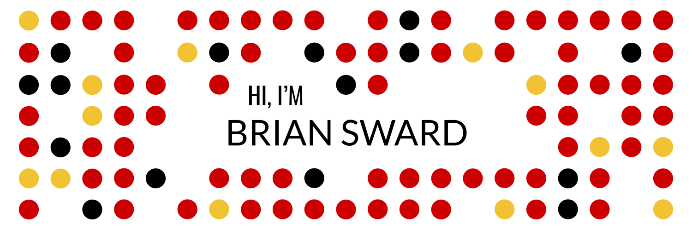

- 🔭 I am pursing software development to find a meaningful role to help minimize food poverty and housing scarcity 
- 🌱 I have completed a Advanced Python Development Program at Code Fellows in Seattle, WA with over 1000 hours of software development classes and lab time! I love it and look forward to learning even more with this foundation.
- 👯 I’m looking to collaborate on open source projects where I can contribute with my ample math and burgeoning programming skills.
- 💬 Ask me about my dogs. Their names are [Chickpea and Bebop](https://www.instagram.com/chickpeaster/).
- 📫 How to reach me: Check me out at [briansward.com](http://www.briansward.com).
- 😄 Pronouns: He/Him
- Skills: Python, Django, Django REST, Flask, JavaScript, REACT, SQL, Excel, Lean/Six Sigma Green Belt, Agile/Waterfall Methods
- Hobbies: Table Top Strategy Games, Running, Maths
